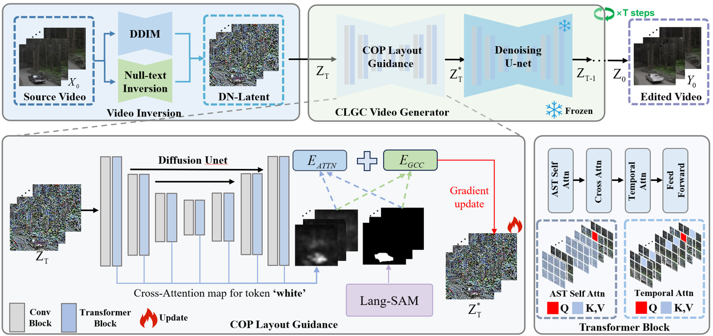
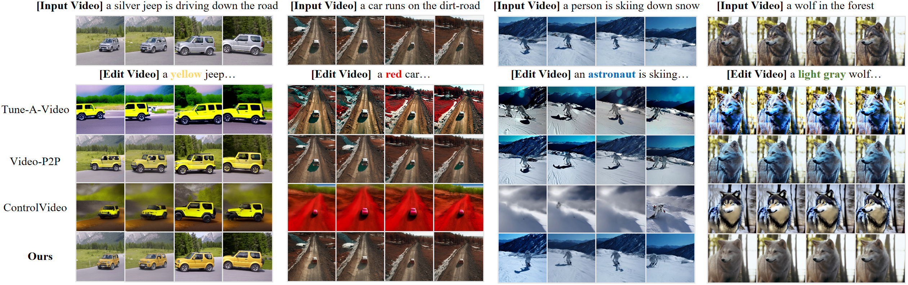
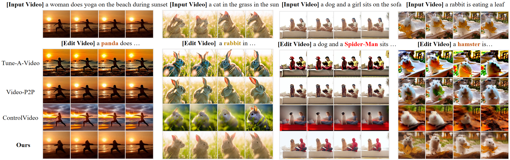

# [ICME2025]CLGC：Continuous Layout Guidance for Consistent Text-to-Video Editing
This repository will contain the implementation of the following paper:
> **CLGC：Continuous Layout Guidance for Consistent Text-to-Video Editing** 
## Overview
Text-to-Video (T2V) editing aims to produce temporally consistent videos aligned with text prompts, simultaneously reconstructing the original spatial structure. Existing methods rely on cross-attention maps generated from fixed text prompts, which lack sufficient spatial information, leading to inaccurate object positioning across frames. Additionally, existing methods only rely on the first or former frame to synthesize the current frame, offering limited viewpoint information and causing flickering artifacts. To address these issues, we propose CLGC, a training-free framework for continuous layout-guided T2V editing. First, we introduce semantic masks for continuous object position layout guidance, refining cross-attention maps and ensuring accurate object positioning across frames. Second, we adaptively integrate extra reference frames into the self-attention for the current frame synthesis, enhancing temporal consistency in the edited video. Finally, we integrate parallel null-text inversion to improve DDIM sampling, achieving accurate
reconstruction results. Extensive experiments demonstrate that CLGC excels at attribute editing and shape transformation, confirming its effectiveness in T2V editing.

## Framework

## Comparison

## Code
The code will be comming soon.

